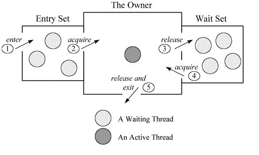

# 概念

CPU切分时间周期性的切换线程实现并发。JAVA的线程机制是抢占式的(周期性中断切换)，应该有意识的插入让步语句。


# Thread

垃圾回收无法对这个类对象进行回收，只能等其死亡

## sleep()

Tread.sleep()睡眠，交出CPU，**不释放资源锁**，处于阻塞状态。

> TimeUnit.SECEND.sleep(num)，以指定时间单位 


## wait() [Object类]

wait([long time])，让线程交出CPU，释放资源锁，处于阻塞状态，当时间到或是notify()时唤醒。


## notify()

通知一个线程获取锁，不一定马上唤醒线程


## yield()

Thread.yield()放弃运行，进入就绪状态，让出CPU，**不放资源锁**。它能让当前线程由“**运行状态**”进入到“**就绪状态**”，从而让其它具有相同优先级的等待线程获取执行权；但是，并不能保证在当前线程调用yield()之后其它具有相同优先级的线程就一定能获得执行权，也有可能是**当前线程又进入到“运行状态”**继续运行。

> thread1 priority 5
>
>  thread2 priority 6
>
> 如果只有这两个线程竞争，thread2.yield()，还是thread2继续运行。因为thread2.yield()后，thread1.thread2一起竞争，结果thread2的优先级高，使所以又是thread2运行


## join()

别的线程join()加入运行，外部调用**线程B**的方法的**线程A**被阻塞，让出CPU和资源，直到这个方法的所有者**线程B**运行结束

## Thread.currentTread()

获取当前线程的引用，与this有区别，new Thread(new MyThread())时，Thread.currentTread()为new Thread()对象，而this则是new MyThread()对象

## 线程池ThreadPoolExcutors

构造方法

```java
public ThreadPoolExecutor(int corePoolSize,int maximumPoolSize,long keepAliveTime,TimeUnit unit,
        BlockingQueue<Runnable> workQueue,ThreadFactory threadFactory,RejectedExecutionHandler handler);
```

- **corePoolSize**：**核心池的大小**，（即在没有任务需要执行的时候线程池的大小，并且只有在工作队列满了的情况下才会创建超出这个数量的线程）。在创建了ThreadPoolExecutor后，默认情况下，线程池中并没有任何线程，而是等待有任务到来才创建线程去执行任务，除非调用了prestartAllCoreThreads()或者prestartCoreThread()方法，从这2个方法的名字就可以看出，是预创建线程的意思，即在没有任务到来之前就创建corePoolSize个线程或者一个线程。默认情况下，在创建了线程池后，线程池中的线程数为0，当有任务来之后，就会创建一个线程去执行任务，当线程池中的线程数目达到corePoolSize后，就会把到达的任务放到**缓存队列**当中；

- **maximumPoolSize**：**线程池最大线程数**，这个参数也是一个非常重要的参数，它表示在线程池中最多能创建多少个线程；

  > maximumPoolSize = 核心线程数 + 非核心线程数

- **keepAliveTime**：**表示线程没有任务执行时最多保持多久时间会终止**。**poolSize**（当前线程池线程数）大于**corePoolSize**时，起作用。**poolSize**等于**corePoolSize**时，是否起作用，取决于**allowCoreThreadTimeOut**。

- **allowCoreThreadTimeOut**：

  该属性用来控制是否允许核心线程超时退出。如果线程池的大小已经达到了**corePoolSize**，不管有没有任务需要执行，线程池都会保证这些核心线程处于存活状态。

- **unit**：参数keepAliveTime的时间单位，有7种取值，在TimeUnit类中有7种静态属性

  >TimeUnit.DAYS;               //天
  >TimeUnit.HOURS;             //小时
  >TimeUnit.MINUTES;           //分钟
  >TimeUnit.SECONDS;           //秒
  >TimeUnit.MILLISECONDS;      //毫秒
  >TimeUnit.MICROSECONDS;      //微妙
  >TimeUnit.NANOSECONDS;       //纳秒

- **BlockingQueue\<Runnable> workQueue**：存放**被提交**但**尚未被执行**的任务的队列

  > 1. **直接提交的任务队列**（SynchronousQueue）-- 不保存拒绝策略取决于「maximumPoolSize」
  >    - SynchronousQueue没有容量。
  >    - 提交的任务不会被真实的保存在队列中，而总是将新任务提交给线程执行。如果没有空闲的线程，则尝试创建新的线程。如果线程数大于最大值maximumPoolSize，则**执行拒绝策略**。
  >
  > 2. **有界的任务队列**（ArrayBlockingQueue）-- 拒绝策略取决于「maximumPoolSize」
  >    - 创建队列时，指定队列的最大容量。
  >    - 若有新的任务要执行，如果线程池中的线程数小于corePoolSize，则会优先创建新的线程。若大于corePoolSize，则会将新任务加入到等待队列中。
  >    - 若等待队列已满，无法加入。如果总线程数不大于线程数最大值maximumPoolSize，则创建新的线程执行任务。若大于maximumPoolSize，则**执行拒绝策略**。
  >
  > 3. **无界的任务队列**（LinkedBlockingQueue）
  >    - 与有界队列相比，除非系统资源耗尽，否则不存在任务入队失败的情况。
  >    - 若有新的任务要执行，如果线程池中的线程数小于corePoolSize，线程池会创建新的线程。若大于corePoolSize，此时又没有空闲的线程资源，则任务直接进入等待队列。
  >    - 当线程池中的线程数达到corePoolSize后，线程池不会创建新的线程。
  >    - 若任务创建和处理的速度差异很大，无界队列将保持快速增长，直到耗尽系统内存。
  >    - 使用无界队列将导致在所有 corePoolSize 线程都忙时，新任务在队列中等待。这样，创建的线程就不会超过 corePoolSize（因此，**maximumPoolSize 就无效**）。当每个任务完全独立于其他任务，即任务执行互不影响时，适合于使用无界队列；例如，在 Web 页服务器中。这种排队可用于处理瞬态突发请求，当命令以超过队列所能处理的平均数连续到达时，此策略允许无界线程具有增长的可能性。
  >
  > 4. **优先任务队列**（PriorityBlockingQueue）
  >    - 带有执行优先级的队列。是一个特殊的无界队列。
  >    -  ArrayBlockingQueue和LinkedBlockingQueue都是按照先进先出算法来处理任务。而PriorityBlockingQueue可根据任务自身的优先级顺序先后执行（总是确保高优先级的任务先执行）。

- **ThreadFactory threadFactory**：

- **RejectedExecutionHandler handler**：线程池对拒绝任务的处理策略。在 ThreadPoolExecutor 里面定义了 4 种 handler 策略，

  > 1. **CallerRunsPolicy** ：这个策略重试添加当前的任务，他会自动重复调用 execute() 方法，直到成功。
  > 2. **AbortPolicy** ：对拒绝任务抛弃处理，并且抛出异常。
  > 3. **DiscardPolicy**：对拒绝任务直接无声抛弃，没有异常信息。
  > 4. **DiscardOldestPolicy**：对拒绝任务不抛弃，而是抛弃队列里面等待最久的一个线程，然后把拒绝任务加到队列。 


### 带返回值的线程执行

#### Callable接口

实现Runnable接口的线程run()方法不会返回值不可以抛出异常，而Callable的call()可以返回结果而且可以抛出异常。Callable的实现与Runnable一样需要Thread线程。执行的方法是call()。

#### Futrue接口

**Future**接口是对Callable执行过程的控制，返回值，异常，结束运行等。实现类**FunableTask**。

需要ExecutorService.submit(Callable实现类对象))调用Callable并返回FutureTask类(Future接口的实现类)。

- FutureTask.isDone()检查是否完成
- FutureTas.get()获取结果，这会使的其他线程被阻塞，直到该线程获得最终结果

```java
	MyCallable callable = new MyCallable(2000);  
	// 将Callable写的任务封装到一个由执行者调度的FutureTask对象 
    FutureTask<String> futureTask = new FutureTask<String>(callable);
	// 创建线程池并返回ExecutorService实例  
 	ExecutorService executor = Executors.newFixedThreadPool(2);   
    executor.execute(futureTask);  // 执行任务 
        while (true) {  
            try {  
                if(futureTas.isDone()){//  两个任务都完成  
                    System.out.println("Done");  
                    executor.shutdown();                          // 关闭线程池和服务   
                    return;  
                }  
                if(!futureTask.isDone()){ 
                    // 任务没有完成，会等待，直到任务完成  
                    System.out.println("FutureTask output="+futureTask.get());  
                }  
            } catch (InterruptedException | ExecutionException e) {  
                e.printStackTrace();  
            }catch(TimeoutException e){  
                //do nothing  
            }  
        }   
```


## 线程中断

每个线程都有一个 打扰 标志。这里分两种情况，

1. **线程在sleep wait join**， 此时如果别的进程调用此进程的 **interrupt() 方法**，此线程会**被唤醒**并被要求处理**InterruptedException**。

2. **此线程在运行中， 则不会收到提醒**。但是此线程的 “中断标志”会被设置， 可以通过**isInterrupted()**查看并作出处理。

**interrupt()**

- 允许自行调用这个方法，其他线程调用的话会，可能会报SecurityException
- 对于处于阻塞状态的线程调用interrupt()，interrupt状态会被清除并报InerruptException()
- 如果被阻塞在Selector选择器中会被从选择器中返回，并标记为true
- 非以上情况会立即标记为true

**this.interrupted()**

测试**当前线程**是否已经中断。线程的中断状态由**该方法清除**。换句话说，如果连续两次调用该方法，则第二次调用返回false。

**终止阻塞状态的线程**

通过try-catch捕获InterruptException来终止线程

- 对于循环体在try-catch内则直接终止退出循环
- 对于循环体在try-catch外则需要手动退出循环

**终止运行状态的线程**

通过“标记”的方式来终止

- **isInterrupt()**来获取是否被中断(通过Thread.Interrupt())设置标记
- 通过额外添加标记的方式类终止，设置中断标志
  设置volatile boolean stop = false 再通过设置stop标志，手动判断是否需要stop

**综合**

```java
@Override
public void run() {
    try {
        // 1. isInterrupted()保证，只要中断标记为true就终止线程。
        while (!isInterrupted()) {// 执行任务...}
    } catch (InterruptedException ie) {  
        // 2. InterruptedException异常保证，当InterruptedException异常产生时，线程被终止。
    }
}
```


# 并发同步

1. 原子性
2. 可见性
3. 有序性

## Synchronized

**参考资料**

- [深入理解多线程（一）——Synchronized的实现原理](http://www.hollischuang.com/archives/1883)

当对一个方法或者代码块使用它时，当一个线程获得了这个锁，那么其它的线程就会陷入挂起状态，在java中也就表现为sleep状态，我们都知道线程的挂起和运行时要转入操作系统的内核态的（与内核态对应的便是用户态），这样特别浪费cpu资源，所以这是个重量级锁。

### 使用方法

**1. 修饰方法**

synchronized方法，一定要显示标明，它是不能隐式标明的，进入同步代码前要获得**当前实例的锁**

**2. 修饰静态方法**

修饰静态方法的对象锁是**类对象**。

**3. 修饰代码块**

> synchronized(this){} //当前对象锁
>
> synchronized(类.class){} //类对象锁

当一个线程访问obj的**一个**synchronized(this)同步代码块时，其他线程对obj中所有**其它**synchronized(this)同步代码块的访问将**被阻塞**。因为**对象锁只有一个**。

### 实现方法

**1. 对象头**

对象是存储在堆中的，**对象模型**在堆内存中包含「对象头」，「对象实际数据」，「对齐填充」。**对象头**包含了「类元数据指针」（**类的信息**，具体存储在**方法区**内），「markword」（GC分代年龄、锁状态标记、哈希码、epoch等信息）

- markwork

  对markword的设计方式上，非常像网络协议报文头：将mark word划分为多个比特位区间，并在不同的对象状态下赋予比特位不同的含义。锁状态：无锁态、轻量级锁、重量级锁、偏向锁、GC标记

**2. Monitor**

与每个java对象相关联，即每个java对象都有一个Monitor与之对应。

- **同步方法**通过`ACC_SYNCHRONIZED`关键字隐式的对方法进行加锁。当线程要执行的方法被标注上`ACC_SYNCHRONIZED`时，需要先获得锁才能执行该方法。

- **同步代码块**通过`monitorenter`和`monitorexit`执行来进行加锁。当线程执行到`monitorenter`的时候要先获得所锁，才能执行后面的方法。当线程执行到`monitorexit`的时候则要释放锁。

他们都是由Monitor（管程）来实现的。在HotSpot虚拟机的源码中，ObjectMoniter实现：

```c++
  ObjectMonitor() {
    _header       = NULL;
    _count        = 0;  //  用来记录该线程获取锁的次数
    _waiters      = 0,
    _recursions   = 0;  //  锁的重入次数
    _object       = NULL;
    _owner        = NULL;  //  指向持有ObjectMonitor对象的线程
    _WaitSet      = NULL;  //  存放处于wait状态的线程队列，
    _WaitSetLock  = 0 ;
    _Responsible  = NULL ;
    _succ         = NULL ;
    _cxq          = NULL ;
    FreeNext      = NULL ;
    _EntryList    = NULL ;  //  存放处于等待锁的block状态的线程队列 
    _SpinFreq     = 0 ;
    _SpinClock    = 0 ;
    OwnerIsThread = 0 ;
  }
```



- 当多个线程同时访问一段同步代码时，首先会进入_EntryList队列中。_
- 当某个线程获取到对象的monitor后进入\_Owner区域并把monitor中的\_Owner变量设置为当前线程，同时monitor中的计数器\_count加1。即获得对象锁。
- 若持有monitor的线程调用wait()方法，将释放当前持有的monitor，\_owner变量恢复为null，\_count自减1，同时该线程进入\_WaitSet集合中等待被唤醒。若当前线程执行完毕也将释放monitor(锁)并复位变量的值，以便其他线程进入获取monitor(锁)。

**3. 锁的升级，优化**

- 锁消除
- 锁粗化

- **自旋锁**：

  通过**占用处理器的时间，不释放CPU**来避免线程切换带来的开销。自旋等待的时间或次数是有一个限度的，如果自旋超过了定义的时间仍然没有获取到锁，则该线程应该被挂起。

  适用于，**锁使用者保持锁时间比较短**的情况。

  会带存在**ABA问题**，即A -> B -> A 对于CAS来说是不变的。解决方法是使用版本号，JAVA中提供了**AtomicStampedReference**/**AtomicMarkableReference**来处理会发生ABA问题的场景

- **偏向锁**：

  大多数情况下，锁总是由同一个线程多次获得。当一个线程访问同步块并获取锁时，会在对象头和栈帧中的锁记录里存储锁偏向的线程ID，偏向锁是一个**可重入的锁**。如果锁对象头的Mark Word里存储着指向当前线程的偏向锁，**无需重新进行CAS操作来加锁和解锁**。当有其他线程尝试**竞争**偏向锁时，持有偏向锁的线程（不处于活动状态）**才会释放锁**。偏向锁无法使用自旋锁优化，因为一旦有其他线程申请锁，就破坏了偏向锁的假定进而升级为轻量级锁。

- **轻量级锁**：

  减少无实际竞争情况下，使用重量级锁产生的性能消耗。JVM会在**当前线程的栈桢中创建用于存储锁记录**的空间，并将对象头中的**Mark Word复制到锁记录**中。然后线程会尝试**使用CAS 指令将对象头中的Mark Word替换为指向锁记录的指针**，成功则当前线程获取到锁，失败则表示其他线程竞争锁当前线程则尝试**使用自旋的方式获取锁**。自旋获取锁失败则锁膨胀会升级为重量级锁。

- **重量级锁**：

  通过对象内部的**监视器(monitor)**实现，其中monitor的本质是依赖于底层**操作系统的Mutex Lock实现**，操作系统实现线程之间的切换需要从用户态到内核态的切换，切换成本非常高。线程竞争不使用自旋，不会消耗CPU。但是线程会进入阻塞等待被其他线程被唤醒，响应时间缓慢。


## Volatile

**参考资料**：

- [【Java 并发笔记】volatile 相关整理](https://www.jianshu.com/p/ccfe24b63d87)

修饰的变量：

1. 使得其他线程对该变量缓存无效
2. 线程修改当前值时立即写入主存中

**保证可见性，不保证原子性**

> 保证变量在**线程间可见**，对volatile变量所有的写操作都能立即反应到其他线程中，换句话说，**volatile变量在各个线程中是一致的**（得益于java内存模型—"先行发生原则"），并不能是该变量为原子操作。比如多个线程同时对**volatile i **执行加1操作，那么**线程A**和**线程B**内存中获取的都是i当前值（假设当前为10），则A，B执行+1过后为11。

```java
public class VolatileApp {
    static private Integer value = 0;   // 输出全为 0 
 // static private volatile Integer value = 0; // 输出可能带有1
    static synchronized void  add(){
            value ++;
        		value --;
    }
    static int get(){ return value;}
    public static void main(String[] args) {
        new Thread(() -> {
            while (true) {
                try {
                    add();
                }catch (Exception e){
                }
            }
        }).start();
        new Thread(() -> {
            while (true) {
                try {
                    System.out.println("read：" + get());
                }catch (Exception e){
                }
            }
        }).start();
        new Thread(() -> {
            try {
                TimeUnit.MILLISECONDS.sleep(1);
                System.exit(10);
            }catch (Exception e){
            }
        }).start();
    }
}
```


**适用条件：**

- 对变量的写操作不依赖于当前值。
- 该变量没有包含在具有其他变量的不变式中。


**使用场景**

**参考资料**：[正确使用 Volatile 变量](https://www.ibm.com/developerworks/cn/java/j-jtp06197.html)

- **状态标志**

  用于指示发生了一个重要的一次性事件，例如完成初始化或请求停机。多线程调用**shutdown()**，**shutdownRequested**变量不依赖当前值，修改为**true**，当一个线程修改值，写入内存中，可以在内存中获取该变量被修改的的内容（**true**）。

  ```java
  volatile boolean shutdownRequested;  
  public void shutdown() { 
    shutdownRequested = true; 
  }
  public void doWork() { 
      while (!shutdownRequested) { 
          // do stuff
      }
  }
  ```

- **一次性安全发布**（单例模式对象实例化）

  缺乏同步会导致无法实现可见性，这使得确定何时写入对象引用而不是原语值变得更加困难。在缺乏同步的情况下，可能会遇到某个对象引用的更新值（由另一个线程写入）和该对象状态的旧值**同时存在**。**volatile**保证singleton可见，判断singleton是否为null的时候及时得知其他线程对其的实例化。

  ```java
  public class Singleton {  
      private volatile static Singleton singleton;  
      private Singleton (){}  
      public static Singleton getSingleton() {  
      if (singleton == null) {  
          synchronized (Singleton.class) {  
          if (singleton == null) {  
              singleton = new Singleton();  
          }  
          }  
      }  
      return singleton;  
      }  
  }
  ```


- 


## ReentrantLock重入锁

> 可重入锁又名递归锁，是指**在同一个线程在外层方法获取锁**的时候，再进入**该线程的内层方法会自动获取锁（前提锁对象得是同一个对象或者class）**，不会因为之前已经获取过还没释放而阻塞
>
> 首先ReentrantLock和NonReentrantLock都继承父类AQS，其父类AQS中维护了一个同步状态status来计数重入次数，status初始值为0。
>
> 当线程尝试获取锁时，可重入锁先尝试获取并更新status值，如果status == 0表示没有其他线程在执行同步代码，则把status置为1，当前线程开始执行。如果status != 0，则判断当前线程是否是获取到这个锁的线程，如果是的话执行status+1，且当前线程可以再次获取锁。而非可重入锁是直接去获取并尝试更新当前status的值，如果status != 0的话会导致其获取锁失败，当前线程阻塞。
>
> 释放锁时，可重入锁同样先获取当前status的值，在当前线程是持有锁的线程的前提下。如果status-1 == 0，则表示当前线程所有重复获取锁的操作都已经执行完毕，然后该线程才会真正释放锁。而非可重入锁则是在确定当前线程是持有锁的线程之后，直接将status置为0，将锁释放。
>
> 要点：
>
> - 可重入锁的一个优点是可一定程度避免死锁
> - AQS通过控制status状态来判断锁的状态，对于非可重入锁状态不是0则去阻塞；对于可重入锁如果是0则执行，非0则判断当前线程是否是获取到这个锁的线程，是的话把status状态＋1，释放的时候，只有status为0，才将锁释放。


### 线程中断响应

线程如果再**等待锁而被阻塞**的时候被调用**interrupt()**，该线程会被唤醒处理**InterruptedException**。如果线程**已经被标志「中断状态」**，再调用lockInterruptibly()来获取锁的时候需要去处理**InterruptedException**。

```java
try{
  lock.lockInterruptibly();
}catch(InterruptedException ie){
  // 处理中断
}finally{
  lock.unlock;
}
```

### 锁申请等待限时

- tryLock() 
  线程尝试加锁，如果没有被其他线程加锁，则使用，否则返回false。
- tryLock(long timeout, TimeUtil unit) 
  在指定时长内获取到锁则继续执行，如果等待指定时长后还没有获取到锁则返回false

### 公平锁

公平锁，就是按照时间先后顺序，使先等待的线程先得到锁，而且，公平锁不会产生饥饿锁，也就是只要排队等待，最终能等待到获取锁的机会。
<br>ReentrantLock rlock = new ReentrantLock(true)获取公平锁

## CountDownLatch

> Java的concurrent包里面的CountDownLatch其实可以把它看作一个计数器，只不过这个计数器的操作是原子操作，同时只能有一个线程去操作这个计数器，也就是同时只能有一个线程去减这个计数器里面的值。可以向CountDownLatch对象设置一个初始的数字作为计数值，任何调用这个对象上的await()方法都会阻塞，直到这个计数器的计数值被其他的

```java
package java.util.concurrent;
import java.util.concurrent.locks.AbstractQueuedSynchronizer;
public class CountDownLatch {
   
    private static final class Sync extends AbstractQueuedSynchronizer {
        private static final long serialVersionUID = 4982264981922014374L;

        Sync(int count) {
            setState(count);
        }

        int getCount() {
            return getState();
        }

        protected int tryAcquireShared(int acquires) {
            return (getState() == 0) ? 1 : -1;
        }

        protected boolean tryReleaseShared(int releases) {
            // Decrement count; signal when transition to zero
            for (;;) {
                int c = getState();
                if (c == 0)
                    return false;
                int nextc = c-1;
                if (compareAndSetState(c, nextc))
                    return nextc == 0;
            }
        }
    }

    private final Sync sync;

    public CountDownLatch(int count) {
        if (count < 0) throw new IllegalArgumentException("count < 0");
        this.sync = new Sync(count);
    }

    public void await() throws InterruptedException {
        sync.acquireSharedInterruptibly(1);
    }

    public boolean await(long timeout, TimeUnit unit)
        throws InterruptedException {
        return sync.tryAcquireSharedNanos(1, unit.toNanos(timeout));
    }

    public void countDown() {
        sync.releaseShared(1);
    }

   
    public long getCount() {
        return sync.getCount();
    }

    public String toString() {
        return super.toString() + "[Count = " + sync.getCount() + "]";
    }
}


```

### 使用

- CountDownLatch latch = new CountDownLatch(3); 

声明一个计数值的类

- this.downLatch.await(); 

调用用这个类的方法线程会阻塞等待，直到计数完成

- this.downLatch.countDown();

调用这个方法为计数值减一

理所当然CountDownLatch是线程安全的，它的减一操作是原子操作，一次只能被一个线程调用。


# ThreadLocal ✏️

用于解决多线程中**相同变量（线程之间不需要彼此的该变量状态）的访问冲突问题**，ThreadLocal会为每一个线程提供一个独立的**变量副本**，从而隔离了多个线程对数据的访问冲突。（**用空间换取性能**）

例子1：

```java
public class ThreadLocalDemo implements Runnable{
private static ThreadLocal<Integer> tl=new ThreadLocal<Integer>();
@Override
public void run() {
    if(tl.get()==null)
    tl.set(new Integer(1));
    System.out.print(tl.get()+"\t");
  }
 public static void main(String args[]) {
    int k=0;
    for(int i=0;i<1000;i++) {
        Thread t=new Thread(new ThreadLocalDemo());
        t.start();
    }
  }
}

/**
输出全为1，即每一个线程都维护自己的一个变量副本
**/
```


  

例子2：

```java
/**当存储的为基本变量或者包装对象时**/
public class ThreadLocalDemo{
  /*定义一个全局变量 来存放线程需要的变量*/
    public static ThreadLocal<Integer> tl = new ThreadLocal<Integer>();
    public static void main(String[] args) {
        /*创建两个线程*/
        for(int i=0; i<2;i++){
            new Thread(new Runnable() {
                @Override
                public void run() {
                    Double d = Math.random()*10;
                    /*存入当前线程独有的值*/
                    tl.set(d.intValue());
                    new A().get();
                    new B().get();
                }
            }).start();
        }
    }
    static class A{
        public void get(){
            /*取得当前线程所需要的值*/
            System.out.println(tl.get());
        }
    }
    static class B{
        public void get(){
            /*取得当前线程所需要的值*/
            System.out.println(tl.get());
        }
    }
}
```

## 内部实现

- initialValue()

```java
protected T initialValue() {
    return null;
}
```

​		在set之前get会调用

- WithInital()

```java
ThreadLocal<Integer> tl = ThreadLocal.withInitial(new Supplier<Integer>() {
        @Override
        public Integer get() {
            // TODO Auto-generated method stub
            return new Integer(8);
        }
    });
    System.out.println(tl.get());
```

​		设置用于创建一个**线程局部变量**，变量的初始化值通过调用Supplier的get方法来确定。

- get()

```java
public T get() {
    //获取当前线程
    Thread t = Thread.currentThread();
    //获取当前线程的ThreadLocalMap对象
    ThreadLocalMap map = getMap(t);
    if (map != null) {
        ThreadLocalMap.Entry e = map.getEntry(this);
        if (e != null) {
            @SuppressWarnings("unchecked")
            T result = (T)e.value;
            return result;
        }
    }
    //变量还没有值，调用初始化方法
    return setInitialValue();
}

private T setInitialValue() {
    T value = initialValue();
    Thread t = Thread.currentThread();
    ThreadLocalMap map = getMap(t);
    if (map != null)
        //map里存储的value为对应的key为当前ThreadLocal对象
        map.set(this, value);
    else
        createMap(t, value);
    return value;
}

ThreadLocalMap getMap(Thread t) {
        return t.threadLocals;
    }
```

 	  返回当前线程的局部变量副本的值，如果此变量没有值，那么会调用initialValue()方法初始化。

- set()

```java
public void set(T value) { 
    //获得当前线程
    Thread t = Thread.currentThread();
    //获取当前线程的ThreadLocalMap对象
    ThreadLocalMap map = getMap(t);
    //若map不为空，将value存入map
    if (map != null)
        map.set(this, value);
    else
        //map为空，创建一个ThreadLocalMap，并将value存入map
        createMap(t, value);
}
```

​		设置当前线程局部变量副本的值

- remove()

```java
public void remove() {
     ThreadLocalMap m = getMap(Thread.currentThread());
     if (m != null)
         //清除value
         m.remove(this);
 }
```

​		该方法用于清除当前线程局部变量的值。变量值被清除后，若当前线程随后通过get读取该变量的值，则**initialValue方法会再次被调用对变量进行初始化**，除非在此期间调用了set方法。

​		经过上面的分析，可知通过ThreadLocal创建的变量是维护在线程内部的，这就意味着线程只要不退出，那么对象的引用将一直存在。当线程退出的时候会进行一些清理工作，如下所示：

```java
private void exit() {
    if (group != null) {
        group.threadTerminated(this);
        group = null;
    }
    /* Aggressively null out all reference fields: see bug 4006245 */
    target = null;
    //加速资源清理，threadLocals为ThreadLocal.ThreadLocalMap类型
    threadLocals = null;
    inheritableThreadLocals = null;
    inheritedAccessControlContext = null;
    blocker = null;
    uncaughtExceptionHandler = null;
}
```

  	此方法为private型，通过系统调用，给线程一个机会在其实际退出之前清理资源。

  	上面多次出现了ThreadLocalMap类，有必要说明一下。ThreadLocalMap的实现采用了**弱引用**，弱引用在垃圾回收的时候被发现就会被回收。ThreadLocalMap内部由一系列的Entry构成，每一个Entry都是WeakReference<ThreadeLocal>类型的：

```java
static class Entry extends WeakReference<ThreadLocal<?>> {
        Object value;
        Entry(ThreadLocal<?> k, Object v) {
            super(k);
            value = v;
        }
    }
```

  内部维护一个Entry数组，用于存放线程的变量

```java
private Entry[] table;
```

## ThreadLocal内存泄漏问题

使用**线程池**，**线程不会消亡**所以**弱引用**不会被**GC**。使用ThreadLocal线程池容易出问题。

## 参考资料

[切底明白ThreadLocal的原理与使用](https://blog.csdn.net/Oeljeklaus/article/details/80545749)

[ThreadLocal原理及内存泄露预防](https://www.baidu.com/link?url=G0oxqOR8_Usu_j1lEEtzzLgY_9mSvVatU-CtZ3cDxWc9uWX_hUFdefrIttTrR7sIXoukPAi4nWFkFxyKsW1zDfYFjnuFx2iFt-rLkbMTHsa&wd=&eqid=b01763ea00088caa000000065d52a71b)


# 底层实现

``` java
//主要的线程方法
private static native void registerNatives();
public static native Thread currentThread();
public static native void yield();
public static native void sleep(long millis) throws InterruptedException;
public final native boolean isAlive(); 
```
这些主要的线程方法是**native**，java的线程实现是由操作系统来实现的。

## 操作系统实现线程

操作系统实现线程的原理有以下三种方式：

- **用户级线程**
- **内核级线程**
- **用户级线程 + 内核级线程，混合实现**

## 用户级线程


​		用户线程指的是建立在**用户空间**的线程库上，系统内核不能感知线程存在的实现。用户线程的建立、同步、销毁和调度完全在**用户态**中完成，不需要内核的帮助。如果程序实现得当，这种线程不需要切换到内核态，因此操作可以是非常快速且低消耗的，并且可以支持规模更大的线程数量。

​		[用户级线程与内核级线程介绍与对比](https://blog.csdn.net/u013568373/article/details/93468678)

## 内核级线程


​		内核线程就是直接由操作系统内核支持的线程，这种线程由内核来完成线程切换，内核通过操纵调度器对线程进行调度，并负责将线程的任务映射到各个处理器上。每个内核线程可以视为内核的一个分身。

​		程序一般不会直接去使用内核线程，而是去使用内核线程的一种高级接口——**轻量级进程**（**Light Weight Process**，**LWP**），轻量级进程就是我们通常意义上所讲的线程，由于每个轻量级进程都由一个内核线程支持，因此只有先支持内核线程，才能有轻量级进程。这种轻量级进程与内核线程之间 **1 ： 1 的关系**称为一对一的线程模型

由于有内核线程的支持，每个轻量级进程都成为一个独立的调度单元，即使有一个轻量级进程在系统调用中阻塞了，也不会影响整个进程继续工作，但是轻量级进程具有它局限性，主要有如下两点:

- 线程的创建、销毁等操作，都需要进行**系统调用**，而系统调用的代价相对较高，需要**在用户态和内核态之间来回切换**。
- 每个**轻量级进程**都需要有一个**内核线程的支持**，因此轻量级进程要消耗一定的内核资源（比如内核线程的栈空间），因此一个系统支持轻量级线程的数量是有限的。

## Java 线程的实现

​		在 JDK 1.2 中，线程模型替换为**基于操作系统原生线程模型**来实现，因此，在目前的 JDK 版本中，操作系统支持怎样的线程模型，在很大程度上决定了 Java 虚拟机的线程是怎样映射的，这点在不同平台上没有办法达成一致，虚拟机规范中也并未限定 Java 线程需要使用哪种线程模型来实现。

​		举个例子，对于 Sun JDK 来说，它的 Windows 版与 Linux 版都是使用**一对一的线程模型**实现的，**一条 Java 线程就是映射到一条轻量级进程之中**，因为 Windows 和 Linux 系统提供的线程模型就是一对一的。

