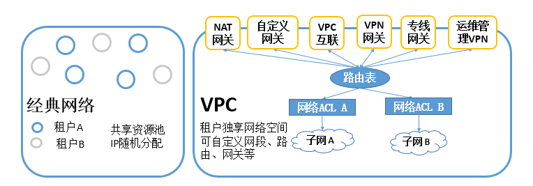

# JAVA

- 方法的参数加上final修饰

**基本数据类型**防止值被改变，方法中如果对该形参进行修改，**会编译不通过**。如果是**对象引用**，防止引用被修改。

- Properties 

  - java自带的Properties类读取.properties文件

  读取路径上的.properties文件（因为properties文件是行一个键值，所以对IO读是行读取的），生成键值对。

  - Spring的读取properties
    1. 使用**PropertyPlaceholderConfigurer**时：
    
       > 该类实现了BeanFactoryPostProcessor
    
       
    
       ```
       //1.自定义类继承于PropertyPlaceholderConfigurer也可以直接使用PropertyPlaceholderConfigurer类，
       
       //进行spring bean配置
       <bean id="propertyConfigurer" class="org.springframework.beans.factory.config.PropertyPlaceholderConfigurer">
             <property name="location">
                 <value>/WEB-INF/configs/sqlServer.properties</value>
             </property>
       </bean>
       
       
       //也可以注入PropertiesFactoryBean
        <bean id="propertyPlaceholderConfigurer" class="org.springframework.beans.factory.config.PropertyPlaceholderConfigurer">
               <property name="properties" ref="configProperties"></property>
        </bean>
       
       // 用法1：Spring的(xml,properties)配置文件中，可以通过${属性名}使用properties文件配置的值
       // 用法2：可以使用@Value("${属性名}")注解读取properties文件配置的值，再给字段赋值
       	         方法1：注解在字段上，给字段赋值
       	         方法2：注解在字段的setter方法中赋值 
       
       
       ```
    
       
    
    
    2. 使用 **PropertiesFactoryBean** 时：
    
       
    
       ```
       //配置bean
       <bean id="configProperties" class="org.springframework.beans.factory.config.PropertiesFactoryBean">
               <property name="locations">
                   <list>
                       <value>classpath*:config.properties</value>
                   </list>
               </property>
           </bean>
       // 用法 @Value("#{configProperties['demo.key']}")
       
       // @Value("#{}")是使用SpEl表达式通常用来获取bean的属性，或者调用bean的某个方法。所以应该是通过SpEL表达式来获取PropertiesFactoryBean的bean的属性（可以用反射获取bean的所有属性来验证）
       ```
    
    3. 两者都是**PropertiesLoaderSupport**的直接实现类。
    
  
- 注解与AOP ✏️

  - 注解

  注解通过反射getAnnotation()获取注解，然后具体要如何对标注目标进行具体操作。

  - Spring AOP

  Spring自身有实现AOP，Spring也有spring-aspects依赖包，使用了aspectj的**语法**，并不是使用aspectj实现AOP。

Spring AOP类与目标类都必须是bean才能生效。对应@Around环绕通知，需要使用ProceedingJoinPoint.procee()来运行目标类方法，如果需要返回值，需要与功能方法返回值一致。

```java

/**
* 代理类
**/
@Aspect
@Service
public class MyAnnotationAspect {
 @Pointcut("@annotation(com.xiong.aopdemo.annotation.MyAnnotation)")
    public void DebugTraceMethod() {}
    @Before("DebugTraceMethod()")
    public void beforeDebugTraceMethod(JoinPoint joinPoint) {
        System.out.println("before");
    }
    @After("DebugTraceMethod()")
    public void afterDebugTraceMethod(JoinPoint joinPoint){
        System.out.println("after");
    }
    @Around("DebugTraceMethod()")
    public Integer aroundDebugTraceMethod(ProceedingJoinPoint pjp)throws Throwable {
        System.out.println("around----start");
        Integer r = (Integer) pjp.proceed();
        System.out.println("around----end");
      
      //返回值与目标方法的返回值一致
        return r;
    }
}
/**
* 目标类
**/
@Service
public class TestDemo {
    @MyAnnotation(value = "hello")
    public Integer printWord(){
        int i=0;
        System.out.println("hello");
        return ++i;
    }
}
```

- java日志系统 ✏️
- 数据库分页 ✏️
- 数据库连接池 ✏️
- google guava ✏️
- jodd工具 ✏️
- 注解 ✏️
- 「import static」静态导入

使得不用“ClassName.xxx”写具体的类来静态导入

- dubbo ✏️
- MessageFormat ✏️
- multi-catch

语法糖，异常类不能是继承关系（当然可以同父类或是祖父类）

```java
catch(IOException | ClassNotFoundException e){
}
```

- java线程池 ✏️

  > Executor框架中的所有类可以分成三类：
  >
  > 1. 任务 
  >    任务有两种类型：Runnable和Callable。
  > 2. 任务执行器 
  >    Executor框架最核心的接口是Executor，它表示任务的执行器。 
  >    Executor的子接口为ExecutorService。 
  >    ExecutorService有两大实现类：**ThreadPoolExecutor**和**ScheduledThreadPoolExecutor**。
  > 3. 执行结果 
  >    Future接口表示异步的执行结果，它的实现类为FutureTask。

  - **ExecutorService**  线程池接口（最顶层**Executor**接口）。

  - **ThreadPoolExecutor** ExecutorService的实现类

  - [Java四种线程池使用](https://blog.csdn.net/achuo/article/details/80623893)

  - **Google Guava** 的**ListeningExecutorService**线程池，为Callable添加**回调方法**callBack

    ```java
    ListeningExecutorService executorService = MoreExecutors.listeningDecorator(threadPoolExecutor); 
    ListenableFuture listenableFuture = executorService.submit(myCallable);
    //回调函数
    Futures.addCallback(listenableFuture, new FutureCallback<T>() {
                    //任务处理成功时执行
                    @Override
                    public void onSuccess(T t) {}
                    //任务处理失败时执行
                    @Override
                    public void onFailure(Throwable throwable) {
                   	System.out.println("处理失败："+throwable);}},executorService);
    ```

    

  - 线程池四种拒绝任务策略

    

- 线程 ✏️

  - Runnable接口
  - Thread类，这个类也是继承了Runnable接口
  - Callable接口
  - ThreadLocal类

  用于解决多线程中**相同变量（线程之间不需要彼此的该变量状态）的访问冲突问题**，ThreadLocal会为每一个线程提供一个独立的**变量副本**，从而隔离了多个线程对数据的访问冲突。（**用空间换取性能**）

  ```java
  /**当存储的为基本变量或者包装对象时**/
  public class ThreadLocalDemo{
    /*定义一个全局变量 来存放线程需要的变量*/
      public static ThreadLocal<Integer> tl = new ThreadLocal<Integer>();
      public static void main(String[] args) {
          /*创建两个线程*/
          for(int i=0; i<2;i++){
              new Thread(new Runnable() {
                  @Override
                  public void run() {
                      Double d = Math.random()*10;
                      /*存入当前线程独有的值*/
                      tl.set(d.intValue());
                      new A().get();
                      new B().get();
                  }
              }).start();
          }
      }
      static class A{
          public void get(){
              /*取得当前线程所需要的值*/
              System.out.println(tl.get());
          }
      }
      static class B{
          public void get(){
              /*取得当前线程所需要的值*/
              System.out.println(tl.get());
          }
      }
  }
  ```

- Vert.x框架 ✏️

- Spring 注解 ✏️

  - @Configration

  该类等价 与XML中配置beans，相当于**Ioc容器**，它的某个方法头上如果注册了@Bean，就会作为这个Spring容器中的Bean，与xml中配置的bean意思一样。

  - @Component与@Configration区别

- Spring 定时 ✏️

- SpringMVC ✏️

SpringMVC框架是以**请求为驱动**，围绕**Servlet**设计，将请求发给控制器，然后通过模型对象，分派器来展示请求结果视图。其中核心类是**DispatcherServlet**，它是一个Servlet，顶层是实现的Servlet接口。

- Tomcat Spring Spring MVC运作流程	

  

  1. tomcat启动。
  2. spring的监听器监听**ServletContext**。
  3. 初始化ServletContext时,马上初始化spring（父），并将spring存入ServletContext中(和儿子的约定的地方)。
  4. 第一次请求DispatcherServlet时，初始化 spring mvc（子）,并且会第一时间去ServletContext中找spring（父）。
  5. spirng mvc 需要什么资源(dao,service等) spring 只要有的都会给他，反过却不是，spring 并不会到spring mvc中去要资源(controller等)。

- SpringMVC - **DispatcherServlet** ✏️

  - DispatcherServlet祖先之一是**Servlet**类
  - DispatcherServlet的**service()**：父类**FrameworkServlet**对**HttpServlet**.**service**重写。
- SpringMVC - **@RequestBody** ✏️

@RequestBody是获取Post请求的body的Json，请求的**Content-type**需为application/json。

- SpringMVC - **@ResponseBody** ✏️

标记在方法上，使用HTTP消息转换器将**返回值**转换为**HTTP响应主体[根据Accept，将对象序列化为响应主体]**。

- Spring - **HttpMessageConverter** ✏️

转换**请求信息**和**响应信息**。

- SpringMVC - 文件上传 ✏️

- 什么时候使用**protected**修饰符 👌

protected修饰符的成员**不能被外部包访问**，这样做的目的是为了能被继承而保证其内部成员不被随意调用。比如一些带有**生命周期方法**（onDestroy(),onCreate()）的类，这些方法不希望被外部调用，但是需要被子类访问。

- Synchronized ✏️

[深入理解Java并发之synchronized实现原理](https://blog.csdn.net/javazejian/article/details/72828483)

- AtomicInteger ✏️

- final关键字 ✏️

- Volatile ✏️

**线程间可见**，对volatile变量所有的写操作都能立即反应到其他线程中，换句话说，**volatile变量在各个线程中是一致的**（得益于java内存模型—"先行发生原则"），并不能是该变量为原子操作。比如多个线程同时对**volatile i **执行加1操作，那么**线程A**和**线程B**内存中获取的都是i当前值（假设当前为10），则AB执行加一过后为11。

**适用条件：**

**变量自身对当前值没有影响。**

volatile只对自己的

- JAVA生成CSV文件

CSV是纯文本文件可以结合velocity模版生成CSV文件。

- invoke ✏️

- java8特性：stream流式处理 ✏️

  集合，数组，文件等能够转化为流的，都能使用流式处理。

- 自己实现DataSource ✏️
  
- **BigDecimal**类高精度运算
  
- Java finally语句到底是在return之前还是之后执行？
  
  [Java finally语句到底是在return之前还是之后执行？](https://www.cnblogs.com/lanxuezaipiao/p/3440471.html)
  
  java是值传递，所以如果在finally对引用指向进行改变是不会影响return值的返回对象的，但是改变引用对象的属性，会被改变。

- **Iterable**接口与**Iterator**接口

  使用遍历接口的好处是：使用者不用去care内部数据结构。

  - Iterable

    ```java
    public interface Iterable<T> {
        Iterator<T> iterator();
        default void forEach(Consumer<? super T> action) {
            Objects.requireNonNull(action);
            for (T t : this) {
                action.accept(t);
            }
        }
        default Spliterator<T> spliterator() {
            return Spliterators.spliteratorUnknownSize(iterator(), 0);
        }
    }
    ```

    实现**Iterable接口**也是返回一个**Iterator实现**来遍历，JDK8版本可以使用forEach（Java提供的语法糖，Java编译器会将其转化为Iterator迭代器方式遍历）。

  - Iterator

    ```java
    public interface Iterator<E> {
        boolean hasNext();
        E next();
        default void remove() {
            throw new UnsupportedOperationException("remove");
        }
        default void forEachRemaining(Consumer<? super E> action) {
            Objects.requireNonNull(action);
            while (hasNext())
                action.accept(next());
        }
    }
    ```

    集合类通过实现Iterator进行遍历。


# 系统

- 日志

  1. **日志接口(slf4j、common.logging)**
      slf4j是对所有日志框架制定的一种规范、标准、接口，并**不是一个框架的具体的实现**，因为接口并不能独立使用，需要和具体的日志框架实现配合使用（如log4j、logback）
  2. **日志实现(log4j、logback、log4j2)**
      log4j是apache实现的一个开源日志组件，logback同样是由log4j的作者设计完成的，拥有更好的特性，用来取代log4j的一个日志框架，是slf4j的原生实现，Log4j2是log4j 1.x和logback的改进版，据说采用了一些新技术（无锁异步、等等），使得日志的吞吐量、性能比log4j 1.x提高10倍，并解决了一些死锁的bug，而且配置更加简单灵活。
  3. **为什么需要日志接口，直接使用具体的实现不就行了吗？**
      接口用于定制规范，可以有多个实现，使用时是面向接口的（导入的包都是slf4j的包而不是具体某个日志框架中的包），即直接和接口交互，不直接使用实现，所以可以任意的更换实现而不用更改代码中的日志相关代码。比如：slf4j定义了一套日志接口，项目中使用的日志框架是logback，开发中调用的所有接口都是slf4j的，不直接使用logback，调用是 自己的工程调用slf4j的接口，slf4j的接口去调用logback的实现，可以看到整个过程应用程序并没有直接使用logback，当项目需要更换更加优秀的日志框架时（如log4j2）只需要引入Log4j2的jar和Log4j2对应的配置文件即可，完全不用更改Java代码中的日志相关的代码logger.info(“xxx”)，也不用修改日志相关的类的导入的包（import org.slf4j.Logger;import org.slf4j.LoggerFactory;
  
- 日志收集分析系统

- 批处理 spring-batch

- 分布式追踪系统APM工具

- MySQL ✏️
  - interval
  - bigint最大值9223372036854775807，20位
  
- UUID ✏️
  
  - 分布式ID生成系统（[美团分布式ID生成系统](https://tech.meituan.com/2017/04/21/mt-leaf.html)）
  
- **请求驱动**与**事件驱动 **✏️

- Git 

  - git merge --squash branchA

  将branchA分支的**所有新的commit**都合成一个**总的commit**（当然需要-m）然后合并到现在分支。这样保持主分支的日志干净。

  - 先commit，再pull，最后push

  commit之后直接push会报**冲突**，然后pull远程分支，这样会有一个**本地merge** 到当前分支，然后push就会带有这个记录。

- 分布式事务 ✏️

  - [RocketMQ分布式事务](https://www.jianshu.com/p/cc5c10221aa1)
  - [分布式事务](https://www.cnblogs.com/savorboard/p/distributed-system-transaction-consistency.html)

- 一致性算法 ✏️

  - https://github.com/maemual/raft-zh_cn/blob/master/raft-zh_cn.md
  
- 配置中心（Apollo）

- sentry错误日志工具 ✏️

- 正则表达式


# RPC实现

序列化+数据传输


# Dubbo

- 协议

| 协议名称   | 实现描述                                                     | 连接                                                         | 使用场景                                                     |
| :--------- | ------------------------------------------------------------ | :----------------------------------------------------------- | ------------------------------------------------------------ |
| dubbo      | 传输：mina、netty、grizzy  <br>序列化：dubbo、hessian2、java、json | dubbo**缺省**采用**单一长连接**和**NIO异步**通讯             | 1.传入传出参数数据包较小  2.消费者 比提供者多  3.常规远程服务方法调用  4.不适合传送大数据量的服务，比如文件、传视频 |
| rmi        | 传输：java  rmi  序列化：java 标准序列化                     | 连接个数：多连接  连接方式：短连接  传输协议：TCP/IP  传输方式：**BIO** | 1.常规RPC调用  2.与原RMI客户端互操作  3.可传文件  4.不支持防火墙穿透 |
| hessian    | 传输：Serverlet容器  序列化：hessian二进制序列化             | 连接个数：多连接     连接方式：短连接     传输协议：HTTP     传输方式：同步传输 | 1.提供者比消费者多  2.可传文件  3.跨语言传输                 |
| http       | 传输：servlet容器  序列化：表单序列化                        | 连接个数：多连接     连接方式：短连接     传输协议：HTTP     传输方式：同步传输 | 1.提供者多于消费者  2.数据包混合                             |
| webservice | 传输：HTTP  序列化：SOAP文件序列化                           | 连接个数：多连接     连接方式：短连接     传输协议：HTTP     传输方式：同步传输 | 1.系统集成  2.跨语言调用                                     |
| thrift     | 与thrift RPC实现集成，并在基础上修改了报文头                 | 长连接、NIO异步传输                                          |                                                              |

- 分组，版本

  **接口+服务分组+版本号**唯一决定一个服务

  - 分组

    不同对于不同分组，提供不同的服务接口实现，如同一个环境的dev与pro分组，服务端"*"可以随机消费任何分组的服务

  - 版本

    不兼容版本的升级，同版本之间调用，以过度升级
	
- 负载均衡

  - 轮询
  - 一致性hash（不均匀的一致性hash）


# Linux

## tail

将指定的文件的最后部分输出到标准设备，假设该档案有更新，tail会自己主动刷新，确保看到最新的档案内容。

- tail -n 20 filename # 显示filename最后20行
- 

## grep

- 参数

```sh
grep命令：
   grep [OPTIONS] PATTERN [FILE...]
        grep:根据模式搜索文本，并将符合模式的文本显示出来。
            使用基本正则表达式定义的模式来过滤文本命令。
        PATTERN:文本字符和正则表达式的元字符组合而成匹配条件。    
    grep -color #对匹配到的文本着色显示
    grep -v     #显示没有被匹配到的行
    grep -i     #忽略大小写
    grep -n     #显示匹配到的行号
    grep -c     #统计匹配的行数，不显示搜索结果
    grep -o     #仅显示匹配到的字符串
    grep -q     #静默（不显示结果）
    grep -A     #显示搜索行及其向下相邻的n行
    grep -B     #显示搜索行及其向上相邻的n行
    grep -C     #显示搜索行及其向上和向下相邻的n行
    grep -e     #支持多个匹配选项 
    grep -e 'root' -e 'bin' /etc/passwd
    grep -w     #匹配整个单词
    grep -E     #或egrep支持扩展的正则表达式
    grep -F     #或fgrep不支持扩展正则表达式
```

- grep 'demo' -C 100 filename #查找档案中demo的前后100行
- grep 'demo' -c filename # #统计档案中demo的个数

## | 管道命令

利用Linux所提供的管道符“|”将两个命令隔开，管道符**左边命令的输出**就会作为管道符**右边命令的输入**。连续使用管道意味着第一个命令的输出会作为 第二个命令的输入，第二个命令的输出又会作为第三个命令的输入，依此类推。

- 

# 网络

- HTTP Content-type


- VCP与经典网络

  

  - **经典网络**

    公有云上所有**用户共享公共网络资源池**，用户之间未做逻辑隔离。用户的内网IP由系统统一分配，相同的内网IP无法分配给不同用户

  - **VPC**

    在**公有云**上为用户建立一块**逻辑隔离的虚拟网络空间**。在VPC内，用户可以自由定义网段划分、IP地址和路由策略，安全可提供网络ACL及安全组的访问控制，因此，VPC有更高的灵活性和安全性。


# SQL

### Mysql

- 什么情况不走索引？

  explain 查看执行计划

  1. 当extra出现**Using filesort**和**Using temproary**这两个时，表示无法使用索引，必须尽快做优化。
  2. 当type出现**index**和**all**时，表示走的是全表扫描没有走索引，效率低下，这时需要对sql进行调优。
  3. 当type出现**ref**或者**range**时，表示走的是索引。

- 分页查询

  ```sql
  select * from table_name limit (page-1)*pageSize,pageSize
  -- 这样查询数据量一大会出现性能问题
  
  select * from table_name a join (select id from table_name limit (page-1)*pageSize,pageSize) b on a.id = b.id
  -- 在limit通过 select 索引字段回提高性能
  
  ```

- 预编译

  mysql执行SQL语句过程1.语义解析 2.优化sql语句，指定执行计划 3.执行语句返回结果

  - jdbc驱动本地预编译
  - mysql服务器预编译
  
- 数据类型后面的数值

  - int，bigint，tinyint后面的数字代表显示位数，int(5),表示表示数据在**显示时显示的最小长度**，<font color="red">只有字段指定zerofill时有用</font>。整型数系统已经限制了取值范围，tinyint占1个字节、int占4个字节。
  - char(m)表示固定字符长度m（无论字符类型），不足以空格代替，所以取值需要**trim()**
  - varchar(m)表示最大长度m，最大以内变长。


# 代码设计


# 符号

| 符号 | 意思    |
| ---- | ------- |
| 👌    | 已完成  |
| ✏️    | 编辑ing |

